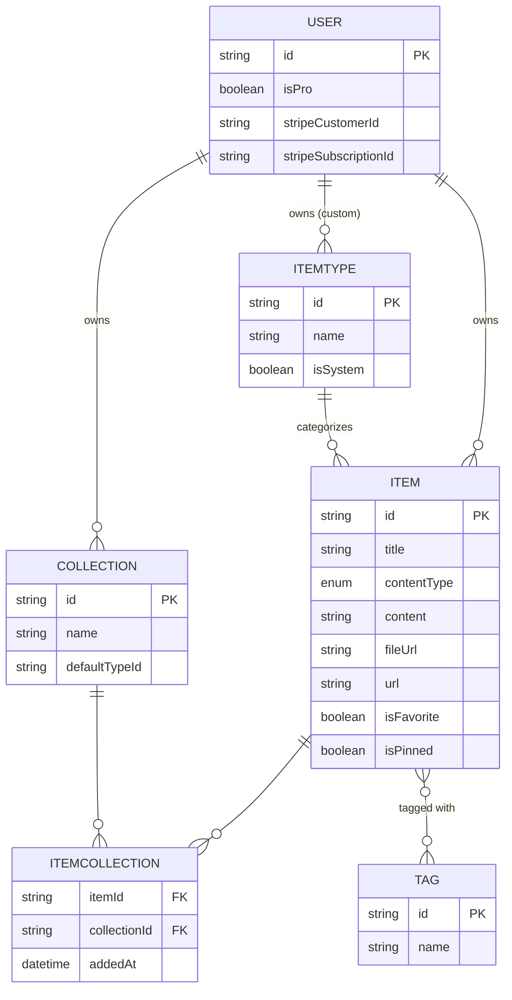
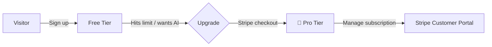

# 📦 DevStash — Project Overview

> One fast, searchable, AI-enhanced hub for all your dev knowledge & resources.

DevStash gives developers a single home for the essentials that are normally scattered across VS Code, Notion, AI chats, bookmarks, gists, and `.txt` files.

---

## 🎯 The Problem

Developers keep their essentials scattered:

| Resource | Where it lives today |
| --- | --- |
| Code snippets | VS Code, Notion |
| AI prompts | Chat histories |
| Context files | Buried in projects |
| Useful links | Browser bookmarks |
| Docs | Random folders |
| Commands | `.txt` files, bash history |
| Project templates | GitHub gists |

The result: **context switching, lost knowledge, and inconsistent workflows.** DevStash consolidates all of it into one searchable, AI-enhanced hub.

---

## 👥 Target Users

- **🧑‍💻 Everyday Developer** — a fast way to grab snippets, prompts, commands, and links.
- **🤖 AI-first Developer** — saves prompts, contexts, workflows, and system messages.
- **🎓 Content Creator / Educator** — stores code blocks, explanations, and course notes.
- **🏗️ Full-stack Builder** — collects patterns, boilerplates, and API examples.

---

## ✨ Features

### A. Items & Item Types

Every stashed resource is an **Item** with a **type**. Users can create custom types (Pro, later), but these **system types** ship first and are immutable:

| Type | Category | Tier | Route example |
| --- | --- | --- | --- |
| Snippet | text | Free | `/items/snippets` |
| Prompt | text | Free | `/items/prompts` |
| Note | text | Free | `/items/notes` |
| Command | text | Free | `/items/commands` |
| Link | url | Free | `/items/links` |
| File | file | **Pro** | `/items/files` |
| Image | file | **Pro** | `/items/images` |

A type resolves to one of three **content categories**: `text` (snippet, prompt, note, command), `url` (link), or `file` (file, image).

Items should be **quick to create and access via a drawer** — no full page navigation required.

### B. Collections

Users group items into **Collections**. An item can belong to **multiple** collections (many-to-many) — e.g. a React snippet in both *React Patterns* and *Interview Prep*.

Examples: `React Patterns` · `Context Files` · `Python Snippets`

### C. Search

Powerful search across **content**, **tags**, **titles**, and **types**.

### D. Authentication

- Email / password
- GitHub OAuth

### E. Other Features

- ⭐ Favorite collections and items
- 📌 Pin items to top
- 🕘 Recently used
- 📥 Import code from a file
- 📝 Markdown editor for text types
- 📤 File upload for file/image types
- 💾 Export data in multiple formats
- 🌙 Dark mode (default for devs)
- 🔀 Add/remove items to/from multiple collections
- 👀 View which collections an item belongs to

### F. 🤖 AI Features (Pro only)

- Auto-tag suggestions
- AI summaries
- "Explain this code"
- Prompt optimizer

---

## 🗄️ Data Model

### Entity Relationships



### Prisma Schema — ⚠️ Rough Draft

> **This is a first-pass sketch, not final.** Field types, indexes, and cascade rules still need review. Validate against [Prisma 7 docs](https://www.prisma.io/docs) before migrating.
>
> **⛔ IMPORTANT:** Never use `prisma db push` or edit the DB structure directly. All schema changes go through **migrations** — run in dev first, then prod.

```prisma
// datasource: Neon PostgreSQL — see prisma/schema.prisma

enum ContentType {
  text
  url
  file
}

model User {
  id                   String       @id @default(cuid())
  email                String       @unique
  name                 String?
  image                String?
  isPro                Boolean      @default(false)
  stripeCustomerId     String?      @unique
  stripeSubscriptionId String?      @unique
  items                Item[]
  collections          Collection[]
  itemTypes            ItemType[]   // custom types; null owner = system type
  createdAt            DateTime     @default(now())
  updatedAt            DateTime     @updatedAt
  // + NextAuth relations (Account, Session)
}

model Item {
  id          String           @id @default(cuid())
  title       String
  contentType ContentType      @default(text)
  content     String?          // text content, or null for files
  fileUrl     String?          // Cloudflare R2 URL, or null for text
  fileName    String?          // original filename
  fileSize    Int?             // bytes
  url         String?          // for link types
  description String?
  language    String?          // optional, for code syntax highlighting
  isFavorite  Boolean          @default(false)
  isPinned    Boolean          @default(false)
  userId      String
  user        User             @relation(fields: [userId], references: [id], onDelete: Cascade)
  itemTypeId  String
  itemType    ItemType         @relation(fields: [itemTypeId], references: [id])
  collections ItemCollection[]
  tags        Tag[]            @relation("ItemTags")
  createdAt   DateTime         @default(now())
  updatedAt   DateTime         @updatedAt

  @@index([userId])
  @@index([itemTypeId])
}

model ItemType {
  id       String  @id @default(cuid())
  name     String
  icon     String  // Lucide icon name, e.g. "Code"
  color    String  // hex, e.g. "#3b82f6"
  isSystem Boolean @default(false)
  userId   String? // null for system types
  user     User?   @relation(fields: [userId], references: [id], onDelete: Cascade)
  items    Item[]
}

model Collection {
  id            String           @id @default(cuid())
  name          String
  description   String?
  isFavorite    Boolean          @default(false)
  defaultTypeId String?          // default type for empty collections
  userId        String
  user          User             @relation(fields: [userId], references: [id], onDelete: Cascade)
  items         ItemCollection[]
  createdAt     DateTime         @default(now())
  updatedAt     DateTime         @updatedAt

  @@index([userId])
}

// Explicit join table so we can track addedAt
model ItemCollection {
  itemId       String
  collectionId String
  addedAt      DateTime   @default(now())
  item         Item       @relation(fields: [itemId], references: [id], onDelete: Cascade)
  collection   Collection @relation(fields: [collectionId], references: [id], onDelete: Cascade)

  @@id([itemId, collectionId])
  @@index([collectionId])
}

model Tag {
  id    String @id @default(cuid())
  name  String
  items Item[] @relation("ItemTags")
}
```

**Open questions to resolve before locking the schema:**

- Should `Tag` be scoped per-user (add `userId` + `@@unique([userId, name])`) to avoid a global tag namespace?
- `contentType` on `Item` overlaps with `ItemType.category` — decide which is the source of truth.
- Add `@@unique` on `ItemType.name` per user to prevent duplicate custom types.

---

## 🛠️ Tech Stack

| Layer | Choice | Notes |
| --- | --- | --- |
| Framework | [Next.js 16](https://nextjs.org) / [React 19](https://react.dev) | SSR pages + dynamic components; API routes for backend |
| Language | [TypeScript](https://www.typescriptlang.org) | End-to-end type safety |
| Database | [Neon](https://neon.tech) (PostgreSQL) | Serverless Postgres in the cloud |
| ORM | [Prisma 7](https://www.prisma.io/docs) | Migrations only — **no `db push`** |
| Caching | [Redis](https://redis.io) | *Maybe* — TBD |
| File storage | [Cloudflare R2](https://developers.cloudflare.com/r2/) | Uploads for file/image types |
| Auth | [NextAuth v5](https://authjs.dev) | Email/password + GitHub OAuth |
| AI | [OpenAI](https://platform.openai.com/docs) `gpt-5-nano` | Tagging, summaries, explain, optimize |
| Styling | [Tailwind CSS v4](https://tailwindcss.com) + [shadcn/ui](https://ui.shadcn.com) | |

**Architecture principle:** one codebase / one repo for less overhead.

> **⛔ Migration rule (repeated because it matters):** NEVER use `db push` or update DB structure directly. Create migrations, run them in dev, then prod.

---

## 💰 Monetization — Freemium

> During development, **all users get everything.** Build the Pro gating foundation, but leave it open until launch.

### 🆓 Free

- 50 items total
- 3 collections
- All system types **except** files/images
- Basic search
- No file/image uploads
- No AI features

### 💎 Pro — $8/month or $72/year

- Unlimited items & collections
- File & image uploads
- Custom types *(later)*
- AI auto-tagging, code explanation, prompt optimizer
- Data export (JSON / ZIP)
- Priority support



---

## 🎨 UI / UX

**Vibe:** Modern, minimal, developer-focused. Dark mode by default, light mode optional. Clean typography, generous whitespace, subtle borders and shadows, syntax-highlighted code blocks.

**References:** [Notion](https://notion.so) · [Linear](https://linear.app) · [Raycast](https://raycast.com)

### Layout

```
┌──────────────┬─────────────────────────────────────────┐
│  SIDEBAR     │  MAIN CONTENT                            │
│ (collapsible)│                                          │
│              │  ┌────────┐ ┌────────┐ ┌────────┐        │
│  Item Types  │  │ Collec-│ │ Collec-│ │ Collec-│  ← bg  │
│  • Snippets  │  │ tion   │ │ tion   │ │ tion   │  color │
│  • Commands  │  │ card   │ │ card   │ │ card   │        │
│  • Prompts   │  └────────┘ └────────┘ └────────┘        │
│  • Notes     │                                          │
│  • Links     │  ┌──────┐ ┌──────┐ ┌──────┐ ┌──────┐     │
│              │  │ item │ │ item │ │ item │ │ item │ ←   │
│  Collections │  └──────┘ └──────┘ └──────┘ └──────┘ border│
│  (latest)    │                                    color  │
└──────────────┴─────────────────────────────────────────┘
                        │
                        └─▶ Item click → quick-access drawer
```

- **Sidebar:** item types (links to filtered item lists) + latest collections.
- **Main:** grid of collection cards, **background-colored by the item type they hold most of**. Items render as cards **border-colored by their type**.
- **Drawer:** individual items open in a fast, in-place drawer for view/create/edit.

### 🎨 Type Colors & Icons

Icons are [Lucide](https://lucide.dev) names.

| Type | Icon | Color | Swatch |
| --- | --- | --- | --- |
| Snippet | `Code` | `#3b82f6` | 🔵 blue |
| Prompt | `Sparkles` | `#8b5cf6` | 🟣 purple |
| Command | `Terminal` | `#f97316` | 🟠 orange |
| Note | `StickyNote` | `#fde047` | 🟡 yellow |
| File | `File` | `#6b7280` | ⚪ gray |
| Image | `Image` | `#ec4899` | 🌸 pink |
| Link | `Link` | `#10b981` | 🟢 emerald |

### Responsive

- Desktop-first, but fully usable on mobile.
- Sidebar collapses into a drawer on mobile.

### Micro-interactions

- Smooth transitions
- Hover states on cards
- Toast notifications for actions
- Loading skeletons

---

## 🔗 Reference Links

- **Next.js** — https://nextjs.org/docs
- **Prisma** — https://www.prisma.io/docs
- **Neon** — https://neon.tech/docs
- **NextAuth v5** — https://authjs.dev
- **Cloudflare R2** — https://developers.cloudflare.com/r2/
- **shadcn/ui** — https://ui.shadcn.com
- **Tailwind CSS** — https://tailwindcss.com/docs
- **Lucide Icons** — https://lucide.dev/icons
- **OpenAI API** — https://platform.openai.com/docs
- **Stripe** — https://stripe.com/docs
